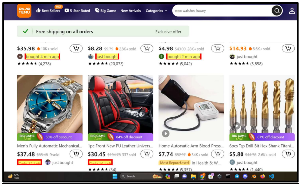
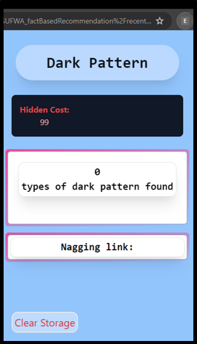
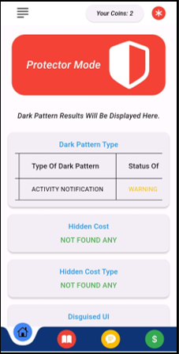
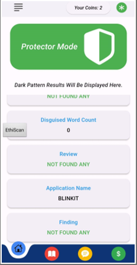

# 🛡️ EthiScan: Detecting Dark Patterns in E-Commerce

EthiScan is an advanced solution designed to identify and mitigate deceptive practices (dark patterns) in e-commerce platforms. This project employs **machine learning (XLNet for tokenization, Random Forest for classification)** and integrates seamlessly across a **browser extension, mobile application, and admin panel** to provide a comprehensive approach to ethical online shopping.

## 🚀 Features
- **Real-Time Dark Pattern Detection**: Flags 14 different deceptive tactics used in e-commerce platforms.
- **Multi-Platform Support**: Available as a **browser extension, mobile app, and admin panel** for complete coverage.
- **AI-Powered Analysis**: Uses **XLNet and Random Forest models** to detect manipulation in online shopping experiences.
- **Privacy-Focused**: Ensures user data protection while analyzing website content.
- **User-Friendly Interface**: Intuitive dashboards for easy navigation and monitoring.

## 🔧 Tech Stack
- **Machine Learning**: Python, XLNet, Random Forest
- **Web Technologies**: JavaScript, React, Node.js
- **Mobile Development**: Flutter
- **Browser Extension**: Manifest v3, JavaScript
- **Backend**: FastAPI, PostgreSQL

## 🎯 Impact
EthiScan empowers users to make informed online shopping decisions by exposing manipulative tactics used by e-commerce platforms. This project bridges the gap between **consumer awareness** and **automated fraud detection**.

## 🖼️ Project Images
Here are some images showcasing the EthiScan project:

Feel free to explore the visuals to better understand the functionalities and design of EthiScan.

📄 **[Project Documentation](Attach relevant link if available)**  
